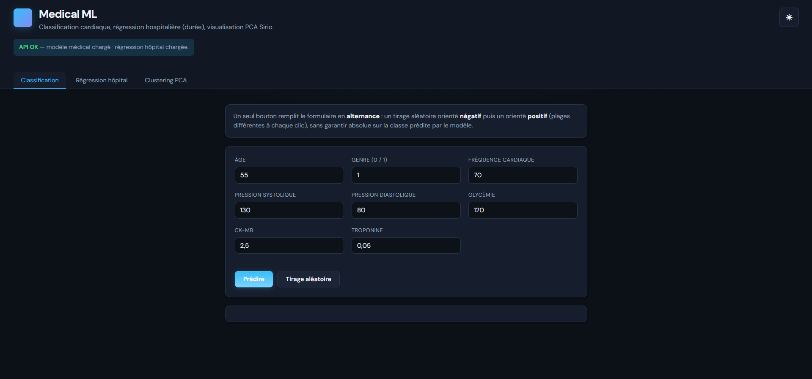
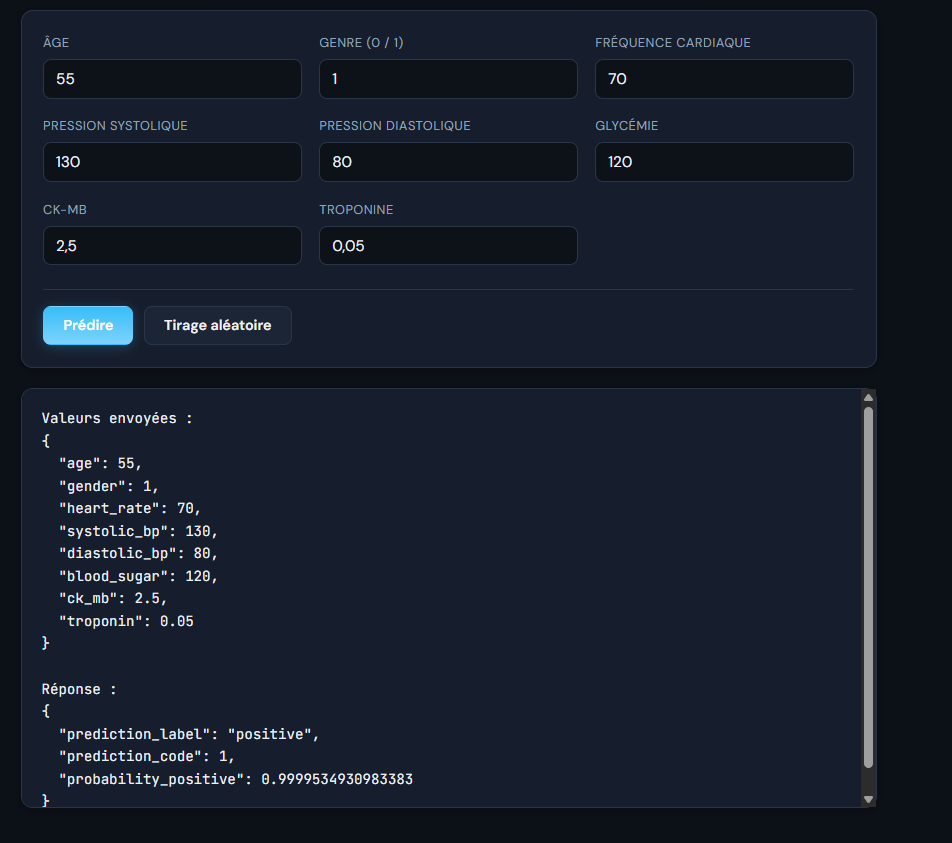
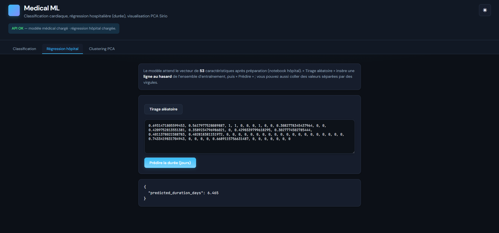
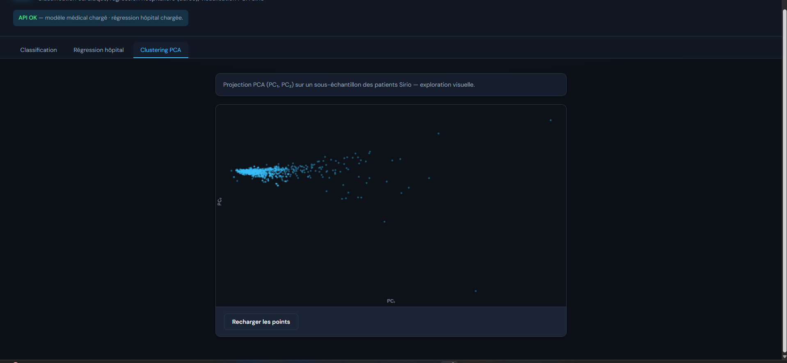
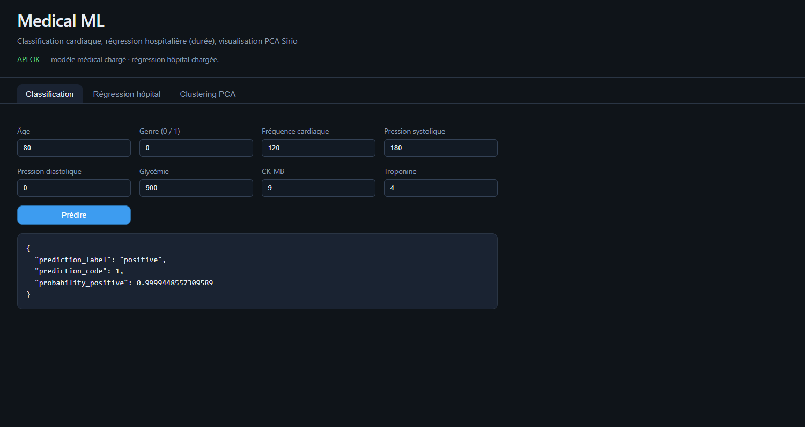
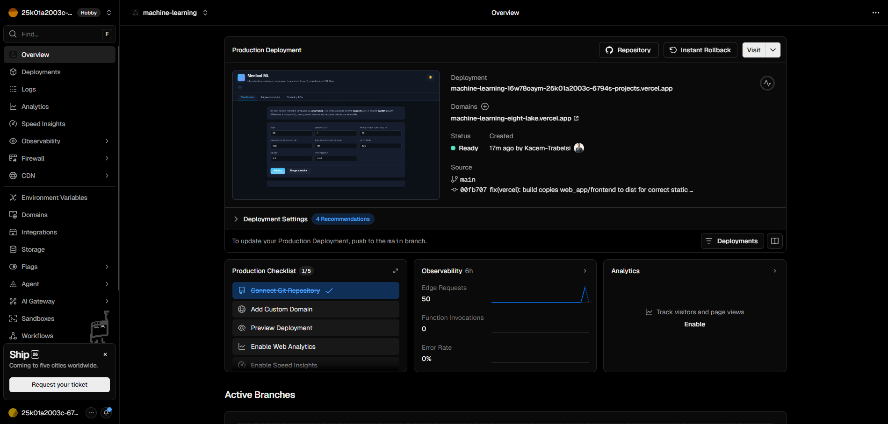

# Rapport de projet — Plateforme Medical ML (Web, déploiement & intégration)

<!-- 
  Export PDF suggéré :
  - VS Code / Cursor : extension "Markdown PDF" ou imprimer depuis prévisualisation.
  - Pandoc : pandoc docs/RAPPORT_PROJET_ML_WEB.md -o RAPPORT.pdf --pdf-engine=xelatex -V geometry:margin=2.5cm
  - Les images sont référencées depuis le dossier docs/ (chemins images/...).
-->

---

## Page de garde

| Élément | Contenu |
|--------|---------|
| **Titre** | Projet Medical ML — Application web & déploiement cloud |
| **Auteur / équipe** | CodeCraft |
| **Institution / formation** | ESPRIT |
| **Encadrante** | Jihen Hlel |
| **Date** | 4 mai 2026 |
| **Référentiel Git** | `https://github.com/Kacem-Trabelsi/machine_learning` _(ajuster si autre fork)_ |

---

## Table des matières

1. [Introduction](#1-introduction)  
2. [Vue d’ensemble du dépôt](#2-vue-densemble-du-dépôt)  
3. [Architecture technique](#3-architecture-technique)  
4. [Backend — API FastAPI](#4-backend--api-fastapi)  
5. [Frontend — interface utilisateur](#5-frontend--interface-utilisateur)  
6. [Déploiement — Render (Blueprint)](#6-déploiement--render-blueprint)  
7. [Déploiement — Vercel](#7-déploiement--vercel)  
8. [Chaîne de bout en bout](#8-chaîne-de-bout-en-bout)  
9. [Captures d’écran — interface & Vercel](#9-captures-décran--interface--vercel)  
10. [Conclusion](#10-conclusion)

---

## 1. Introduction

Ce document décrit **la partie intégration logicielle** du projet : mise en œuvre d’une **API REST** exposant les modèles, d’une **interface web** (thème clair/sombre), et du **déploiement** sur **Render** (backend) et **Vercel** (frontend statique), avec **Blueprint Render** pour reproduire l’infrastructure.

**Objectifs couverts par ce rapport :**

- Expliquer comment le code ML existant dans le dépôt est **branché** sur l’API et le front.  
- Documenter **Render** et **Vercel** (commandes de build, fichiers de configuration, variables).  
- Illustrer le résultat par des **captures d’écran** (interface hébergée et tableau de bord Vercel).

---

## 2. Vue d’ensemble du dépôt

Le dépôt combine :

- **Dossiers notebooks & données** (travail ML déjà réalisé) :  
  - `classification_Medical_data _set/`  
  - `regression_hospital_data _set/`  
  - `clustering_sirio_covid_data_set/`  
- **Application web** :  
  - `web_app/backend/` — Python, FastAPI, pipelines d’inférence.  
  - `web_app/frontend/` — HTML, CSS, JavaScript (sans framework imposé).  
  - `web_app/requirements.txt` — dépendances serveur.  
  - `web_app/artifacts/` — artefacts `*.pkl` générés localement ou au build Render (**non versionnés** par défaut).

À la racine : `render.yaml` (Blueprint), `runtime.txt`, `vercel.json`, `package.json`, `scripts/vercel-build.js` pour le déploiement frontend.

---

## 3. Architecture technique

Schéma logique :

```text
[Navigateur / Vercel]          [Render — service Web Python]
        |                                   |
        |  HTTPS  (CORS autorisé)            |
        +---------- GET/POST /api/* -------->|
        |                                   +-- FastAPI (uvicorn)
        |                                   +-- joblib : modèles
        |                                   +-- pandas / données CSV du repo
        |
   config.js : window.ML_API_BASE = URL Render
```

- Le **frontend** peut aussi être servi **par la même instance FastAPI** (`/` et fichiers statiques) lorsqu’on ouvre uniquement l’URL Render.  
- Sur **Vercel**, seul le **frontend statique** est hébergé ; les appels API visent l’URL **Render** définie dans `web_app/frontend/config.js`.

---

## 4. Backend — API FastAPI

**Emplacement :** `web_app/backend/`

**Fichiers principaux :**

| Fichier | Rôle |
|---------|------|
| `main.py` | Application FastAPI : routes, CORS, montage statique, chargement des `.pkl` au démarrage. |
| `medical_pipeline.py` | Préparation alignée sur le notebook médical (features, imputation, `RobustScaler`), bundle modèle + `predict_one`. |
| `train_artifacts.py` | Entraîne / sérialise `medical_deploy_bundle.pkl` et `hospital_rf.pkl` dans `web_app/artifacts/`. |

**Endpoints REST (synthèse) :**

| Méthode | Chemin | Description |
|---------|--------|-------------|
| `GET` | `/api/health` | État de l’API et chargement des modèles. |
| `POST` | `/api/medical/predict` | Classification binaire : entrées cliniques brutes → probabilité / label. |
| `GET` | `/api/hospital/feature-names` | Noms des 53 variables de la régression. |
| `GET` | `/api/hospital/random-features` | Tirage aléatoire d’une ligne de `X_train` (vecteur préparé). |
| `GET` | `/api/hospital/example-features` | Exemple fixe (première ligne) — optionnel. |
| `POST` | `/api/hospital/predict` | Régression : vecteur de 53 nombres → durée prédite (jours). |
| `GET` | `/api/clustering/pca2d` | Échantillon PC₁ / PC₂ pour visualisation (données Sirio déjà en PCA). |
| `GET` | `/` | Page d’accueil statique (si fichiers présents). |
| `GET` | `/styles.css`, `/app.js`, etc. | Assets frontend servis par le backend si besoin. |

**CORS :** configuration ouverte (`allow_origins` large) pour faciliter Vercel + tests locaux — à durcir en production réelle.

**Artefacts :** générés par `train_artifacts.py` (_gradient boosting_ médical + _random forest_ hôpital sur matrices déjà préparées dans le dépôt).

---

## 5. Frontend — interface utilisateur

**Emplacement :** `web_app/frontend/`

**Stack :** HTML5, CSS3 (variables de thème `data-theme`), JavaScript vanilla (pas de build obligatoire en local).

**Fonctionnalités décrites dans ce rapport :**

- **Onglets** : Classification médicale, Régression hôpital, Nuage PCA.  
- **Classification** : formulaire des 8 variables, bouton « Prédire », « Tirage aléatoire » (alternance de profils), affichage JSON requête + réponse.  
- **Régression** : textarea pour 53 valeurs, « Tirage aléatoire » via API, prédiction durée.  
- **PCA** : canvas 2D, couleurs synchronisées au thème (`--canvas-bg`, etc.).  
- **Thème** : bascule clair / sombre, préférence stockée (`localStorage`).  
- **Configuration production :** `config.js` définit `window.ML_API_BASE` (URL Render sans slash final).

**Polices :** DM Sans, JetBrains Mono (chargées via Google Fonts — nécessite réseau ou fallback système).

---

## 6. Déploiement — Render (Blueprint)

**Objectif :** héberger l’API Python et, si besoin, la même app sert aussi la page web sur la même URL.

**Fichier Blueprint :** `render.yaml` (racine du dépôt).

**Contenu typique (extrait fonctionnel) :**

- **Type :** service Web (`type: web`), runtime **Python**.  
- **Build :** installation des dépendances (`web_app/requirements.txt`) puis exécution de `train_artifacts.py` dans `web_app/backend` pour recréer les `.pkl` sur l’infra (disque éphémère : régénération à chaque build).  
- **Start :** `uvicorn main:app` depuis `web_app/backend`, hôte `0.0.0.0`, port **`$PORT`** (variable fournie par Render).  
- **Health check :** `GET /api/health`.  
- **Région / plan :** documentés dans le YAML (ex. `frankfurt`, plan gratuit — veille au **cold start**).

**Fichier `runtime.txt` :** fixe une version de Python compatible pour Render.

**Après déploiement :** noter l’URL HTTPS publique et la reporter dans `config.js` pour Vercel.

---

## 7. Déploiement — Vercel

**Problème résolu côté dépôt :** Vercel servait la racine Git sans `index.html` → erreur 404.  

**Solution :**

- **`vercel.json`** (racine) : `buildCommand` = `npm run vercel-build`, `outputDirectory` = `dist`.  
- **`package.json`** (racine) : script `vercel-build`.  
- **`scripts/vercel-build.js`** : copie récursive `web_app/frontend` → `dist/`, ce qui place **`index.html` à la racine du déploiement**.

**Paramètres Vercel (recommandés) :**

- **Root Directory :** racine du dépôt (là où se trouvent `vercel.json` et `package.json`).  
- Le dossier **`dist/`** est ignoré par Git ; il est produit **sur les serveurs Vercel** à chaque build.

**Lien avec le backend :** le fichier **`config.js`** (copié dans `dist`) doit contenir l’URL Render exacte pour que `fetch` atteigne l’API.

---

## 8. Chaîne de bout en bout

1. **Développement local** : `python web_app/backend/train_artifacts.py` puis `uvicorn` dans `web_app/backend`.  
2. **Front local** : ouvrir `http://127.0.0.1:8765/` si le serveur sert les pages, ou ouvrir les fichiers avec `config.js` vide pour même origine.  
3. **Production** : Build Render → URL API ; build Vercel → URL front ; `config.js` → URL API ; vérifier `/api/health` et un formulaire de prédiction.

---

## 9. Captures d’écran — interface & Vercel

Fichiers source : dossier **`docs/images/`** (chemins relatifs au dossier **`docs/`** pour l’export PDF et le script `build_report_pdf.py`).

### Application Medical ML (interface)



*Figure 1 — Vue générale de l’application **Medical ML** déployée (URL Vercel ou locale) : en-tête avec titre, sous-titre, indicateur d’état **API OK** (modèles médical et hôpital chargés), onglets de navigation ; onglet **Classification** actif avec formulaire des variables cliniques (âge, genre, fréquence cardiaque, pressions, glycémie, CK-MB, troponine), boutons **Prédire** et **Tirage aléatoire** ; thème sombre.*



*Figure 2 — Interface après saisie ou tirage aléatoire : zone de résultat affichant le **JSON** envoyé à l’API et la **réponse** du modèle (`prediction_label`, `probability_positive`, etc.), illustrant le lien front ↔ backend Render.*



*Figure 3 — Exemple de navigation vers un autre volet de l’outil (**Régression hôpital** ou **Clustering PCA**) ou bascule **thème clair / sombre** : mise en page des champs, boutons d’action et cohérence graphique (DM Sans, couleurs d’accent).*



*Figure 4 — Fonctionnalité associée à la **régression** (vecteur de 53 valeurs, tirage aléatoire depuis `X_train`, prédiction de durée) ou au **nuage de points PCA** (axes PC₁ / PC₂) selon la capture ; illustre l’exploitation des sorties des notebooks dans l’interface web.*

### Vercel (déploiement & tableau de bord)



*Figure 5 — Tableau de bord **Vercel** : projet front (nom du projet, ex. machine_learningg), liste des **déploiements** en production, statut **Ready** / durée de build, branche **main** et associé commit Git, horodatage et auteur du déploiement ; montre l’intégration continue entre GitHub et Vercel.*



*Figure 6 — Complément sur le projet Vercel : écran de **configuration** (domaine `*.vercel.app`, root directory, variables d’environnement) ou **détail d’un déploiement** (logs, métadonnées) ; confirme la mise en ligne du front statique après build (`npm run vercel-build`, dossier `dist/`).*

---

## 10. Conclusion

Le projet livre une **chaîne complète** entre les modèles issus des notebooks (classification, régression sur données préparées, visualisation PCA) et un **produit web** : API **FastAPI** documentable, interface **responsive** avec **thème clair/sombre**, et déploiement **Render** (Blueprint, régénération des artefacts au build) couplé à **Vercel** (frontend statique après copie vers `dist/`).

Les **captures d’écran** illustrent l’expérience utilisateur et la **mise en production** sur Vercel. Les limites usuelles (plan gratuit, cold start, CORS ouvert, usage pédagogique non clinique) devront être rappelées dans une soutenance ou un mémoire plus large sur le volet **machine learning** et l’éthique des données.

**Perspectives possibles (à développer dans d’autres livrables) :** pipeline hôpital bout-en-bout jusqu’à l’API, durcissement de la sécurité, tests automatisés, monitoring des modèles en production.
